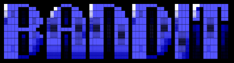

  

# What is Bandit?

[Bandit](https://overthewire.org/wargames/bandit/) is the starting wargame of OverTheWire, aimed at people who are new to Linux and security. Each level has one goal: find the password for the next level. The challenge is figuring out which tools get you there.

> **Note:** Passwords are intentionally omitted, per [OverTheWire's rules](https://overthewire.org/rules/).

---

## Quick Start

~~~ bash
ssh bandit0@bandit.labs.overthewire.org -p 2220
~~~

| Field    | Value                         |
| -------- | ----------------------------- |
| Host     | `bandit.labs.overthewire.org` |
| Port     | `2220`                        |
| Username | `bandit0`                     |
| Password | `bandit0`                     |

Never used SSH before? Start with the [connection guide](sshConnection_guide.md).

---

| Level                                    | Skills Introduced                              | Language | Status |
| ---------------------------------------- | ---------------------------------------------- | -------- | ------ |
| [Level 0 → 1](Levels/Level0/Level0.md)   | `ssh`, `-p` flag, `ls`, `cat`                  | EN       | ✅     |
| [Level 1 → 2](Levels/Level1/Level1.md)   | Files named `-`, `./` prefix                   | EN       | ✅     |
| [Level 2 → 3](Levels/Level2/Level2.md)   | Filenames with spaces, quoting and escaping    | EN       | ✅     |
| [Level 3 → 4](Levels/Level3/Level3.md)   | Hidden files, `ls -a`, `cd`                    | EN       | ✅     |
| [Level 4 → 5](Levels/Level4/Level4.md)   | `file`, glob wildcards `*`                     | EN       | ✅     |
| [Level 5 → 6](Levels/Level5/Level5.md)   | `find` by size, type and permissions           | EN       | ✅     |
| [Level 6 → 7](Levels/Level6/Level6.md)   | `find` across `/`, `2>/dev/null`               | EN       | ✅     |
| [Level 7 → 8](Levels/Level7/Level7.md)   | `grep`, searching large files                  | ES       | ✅     |
| [Level 8 → 9](Levels/Level8/Level8.md)   | `sort`, `uniq`, finding the unique line        | EN       | ✅     |
| [Level 9 → 10](Levels/Level9/Level9.md)  | `file`, `strings`, `grep`                      | EN       | ✅     |
| Level 10 → 11                            | `base64`, decoding data                        |          | ⏳     |
| ...                                      | ...                                            |          | ⏳     |

#### **Legend:** ✅ done · ⏳ pending

---

# Notes
- Early writeups use an older format; later ones use the current format
- Level 7 is written in spanish, i'll translate it later
- This is a work in progress, not totally completed. New levels will be added as I complete them

