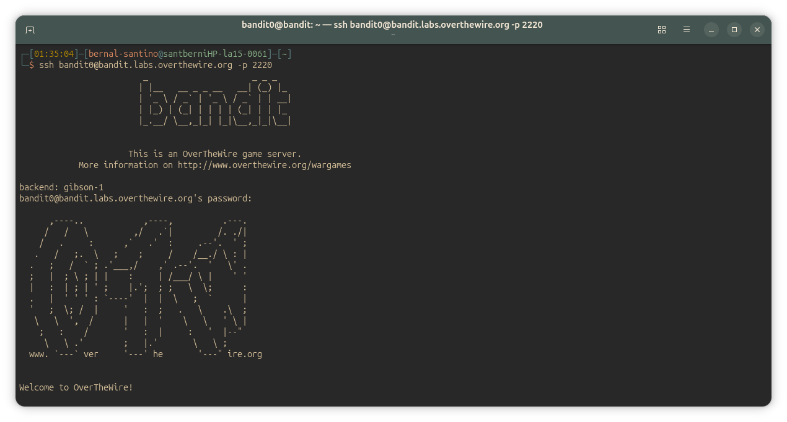
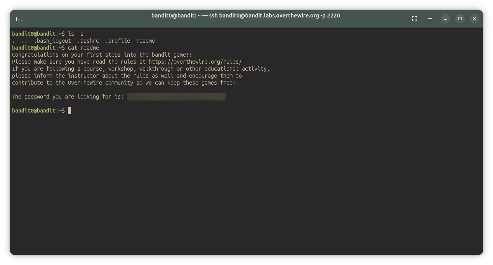

## Bandit Level 0
### Level Goal

The goal of this level is for you to log into the game using SSH. The host to which you need to connect is bandit.labs.overthewire.org, on port 2220. The username is bandit0 and the password is bandit0. Once logged in, go to the Level 1 page to find out how to beat Level 1.
Commands you may need to solve this level:

~~~ bash
 ssh 
~~~

#### Solution
~~~ bash
ssh bandit0@bandit.labs.overthewire.org -p 2220
~~~
**Password:** *bandit0*

---

## Bandit Level 0-1

### Level Goal

The password for the next level is stored in a file called readme located in the home directory. Use this password to log into bandit1 using SSH. Whenever you find a password for a level, use SSH (on port 2220) to log into that level and continue the game.
Commands you may need to solve this level

~~~ bash
ls , cd , cat , file , du , find
~~~

#### Solution
~~~ bash
bandit0@bandit:~$ ls
readme
bandit0@bandit:~$ cat readme
Congratulations on your first steps into the bandit game!!
Please make sure you have read the rules at https://overthewire.org/rules/
If you are following a course, workshop, walkthrough or other educational activity,
please inform the instructor about the rules as well and encourage them to
contribute to the OverTheWire community so we can keep these games free!

The password you are looking for is: <password_here>

bandit0@bandit:~$ 
~~~

---

#### Screenshots

