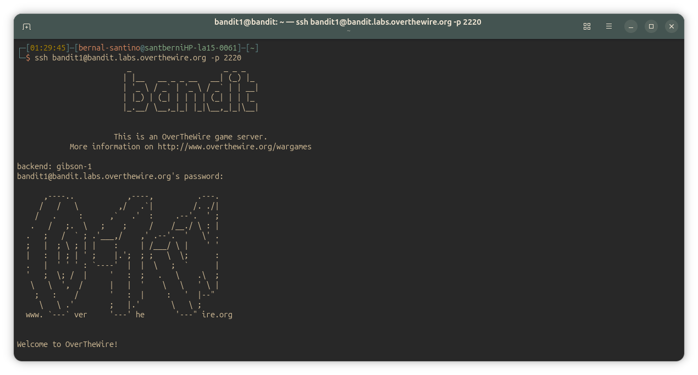
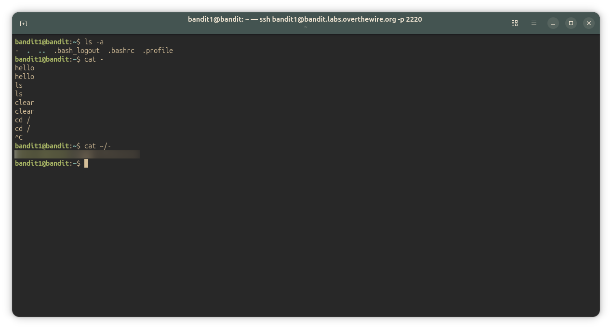

## Bandit Level 1-2
### Level Goal

The password for the next level is stored in a file called - located in the home directory

~~~ bash
ls , cd , cat , file , du , find
~~~

#### Solution
~~~ bash
bandit1@bandit:~$ ls -a
-  .  ..  .bash_logout  .bashrc  .profile
bandit1@bandit:~$ cat -
    #cat '-' gets interpreted as stdin (repeats everything I write in the the terminal until I press ctrl + c)
hello
hello #(terminal)
ls
ls #(terminal)
clear
clear #(terminal)
cd /
cd / #(terminal)

^C

#need the specific path to open the file
bandit1@bandit:~$ cat ~/-
<password_here>
bandit1@bandit:~$ 
~~~

---

#### Screenshots/

