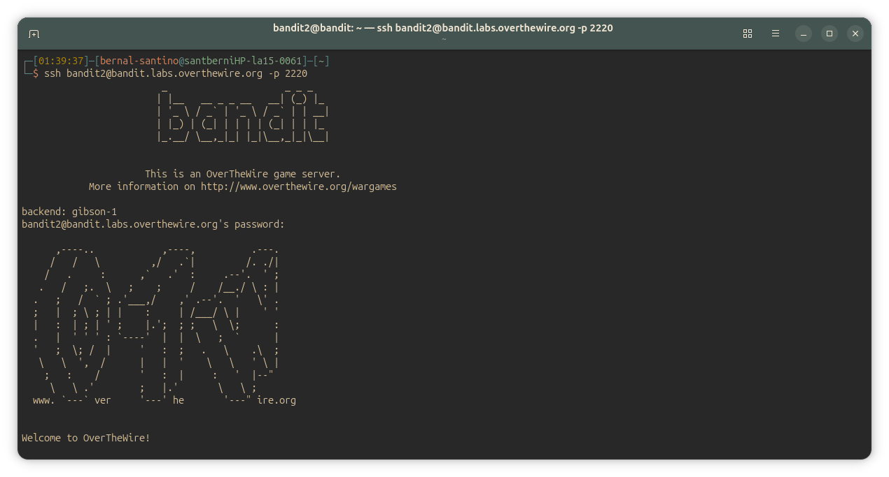
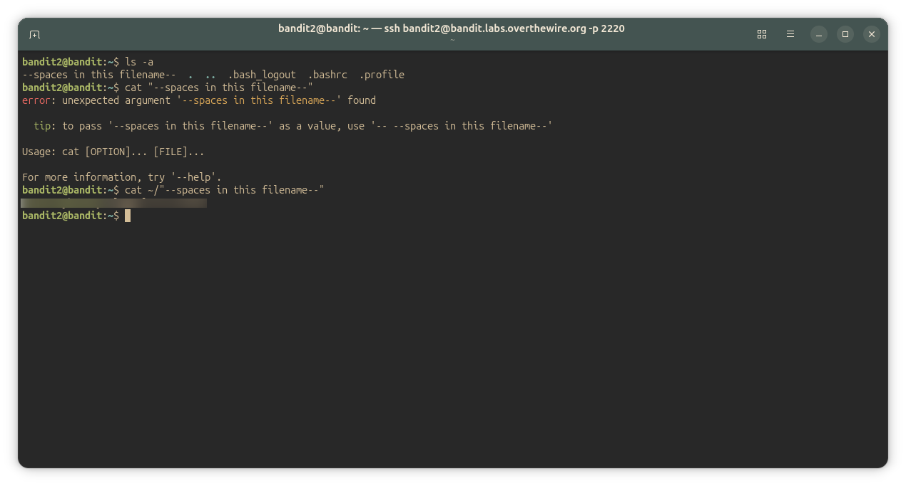

## Bandit Level 2-3
### Level Goal

The password for the next level is stored in a file called --spaces in this filename-- located in the home directory

Commands you may need to solve this level

~~~ bash
ls , cd , cat , file , du , find
~~~

#### Solution
~~~ bash
bandit2@bandit:~$ ls -a
--spaces in this filename--  .  ..  .bash_logout  .bashrc  .profile
bandit2@bandit:~$ cat "--spaces in this filename--"
error: unexpected argument '--spaces in this filename--' found

  tip: to pass '--spaces in this filename--' as a value, use '-- --spaces in this filename--'

Usage: cat [OPTION]... [FILE]...

For more information, try '--help'.
bandit2@bandit:~$ # takes the file as an argument
bandit2@bandit:~$ cat ~/"--spaces in this filename--"
<password_here>

~~~

---

#### Screenshots/

