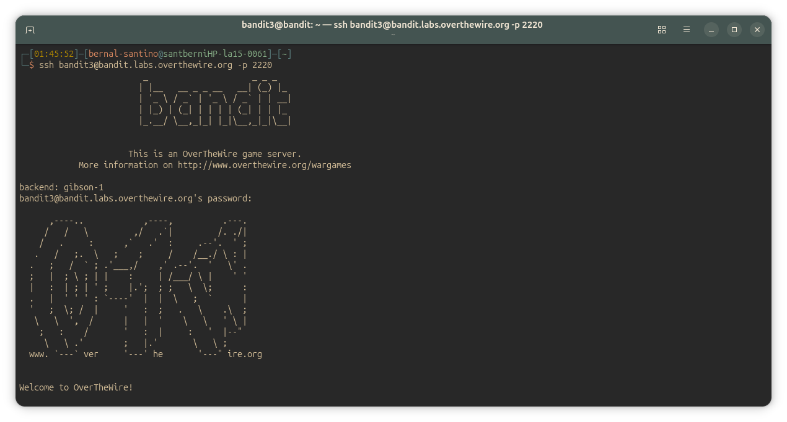
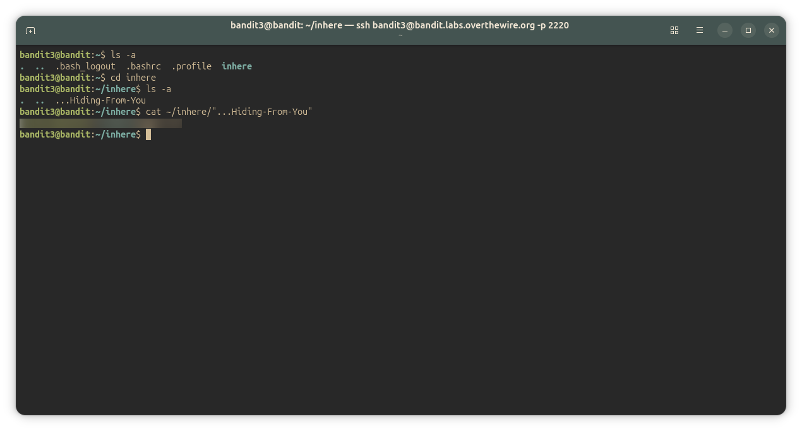

## Bandit Level 3-4
### Level Goal

The password for the next level is stored in a hidden file in the 'inhere' directory.

Commands you may need to solve this level

~~~ bash
ls , cd , cat , file , du , find
~~~

#### Solution
~~~ bash
bandit3@bandit:~$ ls -a
.  ..  .bash_logout  .bashrc  .profile  inhere
bandit3@bandit:~$ cd inhere
bandit3@bandit:~/inhere$ ls -a
.  ..  ...Hiding-From-You
bandit3@bandit:~/inhere$ cat ~/inhere/"...Hiding-From-You"
<password_here>
bandit3@bandit:~/inhere$ 
~~~

---

#### Screenshots/

