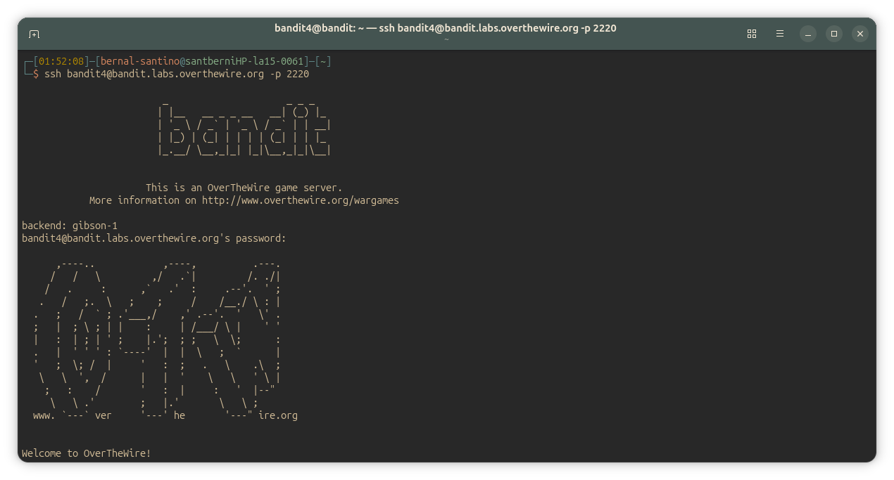
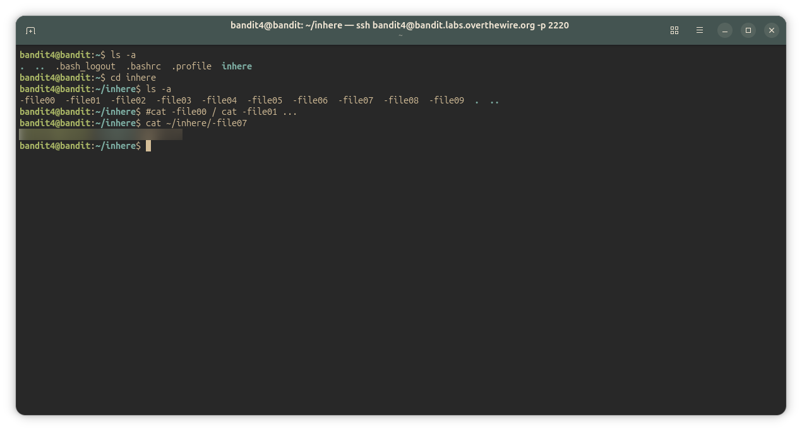
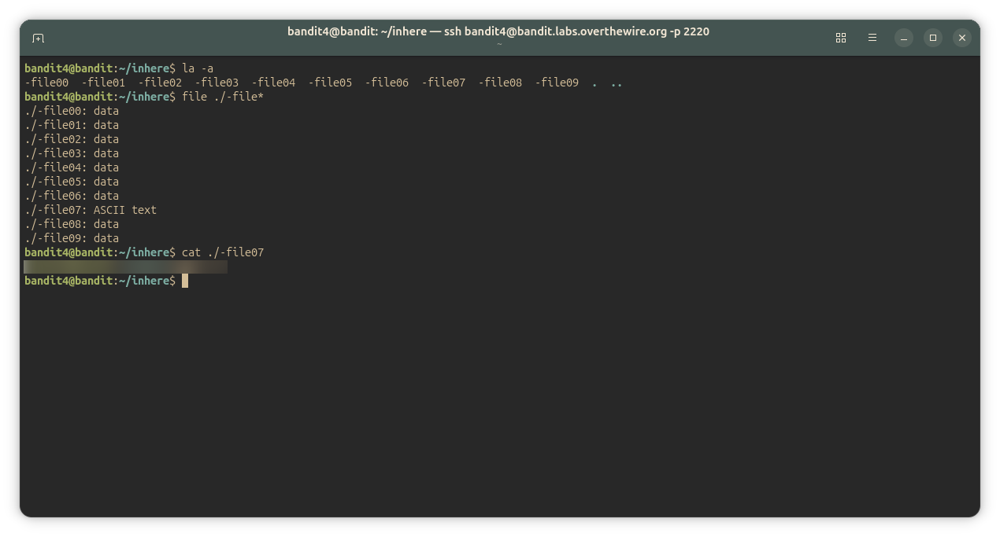

## Bandit Level 4-5
### Level Goal

The password for the next level is stored in the only human-readable file in the inhere directory. Tip: if your terminal is messed up, try the "reset" command.

Commands you may need to solve this level

~~~ bash
ls , cd , cat , file , du , find
~~~

#### Solution
~~~ bash
bandit4@bandit:~/inhere$ ls -a
-file00  -file01  -file02  -file03  -file04  -file05  -file06  -file07  -file08  -file09  .  ..
bandit4@bandit:~/inhere$ cat ~/inhere/"-file00"
bandit4@bandit:~/inhere$ cat ~/inhere/"-file01"
## keep searching manually in the files [...]
bandit4@bandit:~/inhere$ cat ~/inhere/"-file07"
<password_here>
bandit4@bandit:~/inhere$ 
~~~

#### Thoughts

**Manual approach**

I solved it by `cat`-ing each file one by one until I found the readable one. It works, but it's slow and risky — if one of the files is binary, `cat`-ing it can mess up the terminal (hence the "reset" tip in the level goal).

**A better approach: pseudocode**

I think this could be automated with a loop instead of checking files by hand. Something like:

~~~ cpp
for (int x = 0; x < 10; x++) {
    if (is_readable("-file0" + x)) {
        return "-file0" + x << " is readable, it has the key";
    }
}
~~~

**An even better approach: `file`**

After writing the pseudocode above, I found there's a real command that does exactly this: `file ./-file*`. It inspects the content of every file matching the pattern and tells you its type in one shot:

~~~ bash
bandit4@bandit:~/inhere$ file ./-file*
./-file00: data
./-file01: data
./-file02: data
./-file03: data
./-file04: data
./-file05: data
./-file06: data
./-file07: ASCII text
./-file08: data
./-file09: data
~~~

This immediately shows `-file07` is the only human-readable one, no manual guessing or risk of breaking the terminal.
The tool `file` parses the internal structure of files to determine their content: it can guess if the files inside a directory are plain text, .pdf or whatever, and also guess the filetype of the files inside a .zip or .gz if combined with the argument '--uncompress' / '-z':
`file --uncompress project.gz`.
##### Meaning of `file ./-file*`
It means "Guess the filetype of the files in the current working directory whose names start with `-file`".

---

#### Screenshots/

