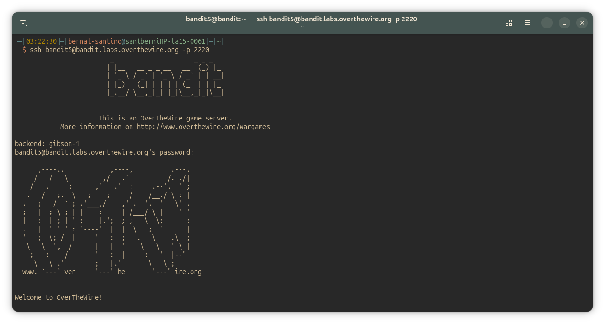
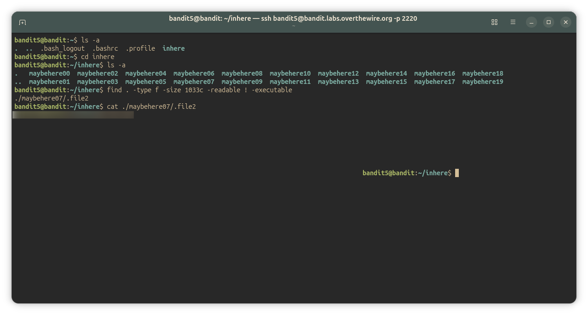

## Bandit Level 5-6
### Level Goal

The password for the next level is stored in a file somewhere under the 'inhere' directory and has all of the following properties:

    human-readable
    1033 bytes in size
    not executable

Commands you may need to solve this level

~~~ bash
ls , cd , cat , file , du , find
~~~

#### Solution
~~~ bash
bandit5@bandit:~/inhere$ ls -a
.   maybehere00  maybehere02  maybehere04  maybehere06  maybehere08  maybehere10  maybehere12  maybehere14  maybehere16  maybehere18
..  maybehere01  maybehere03  maybehere05  maybehere07  maybehere09  maybehere11  maybehere13  maybehere15  maybehere17  maybehere19

bandit5@bandit:~/inhere$ find . -size 1033c ! -executable
## = "buscar en el directorio actual archivos de 1033bytes exactos y que no sean ejecutables"

./maybehere07/.file2

bandit5@bandit:~/inhere$ cat ./maybehere07/".file2"
<password_here>

~~~

---

#### Screenshots/

