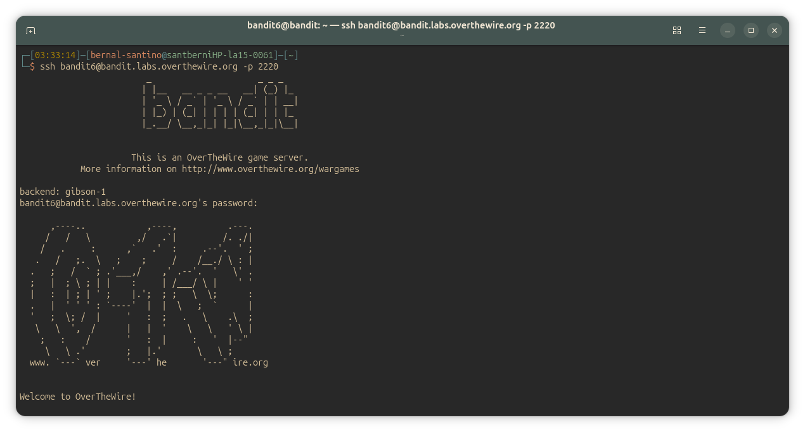
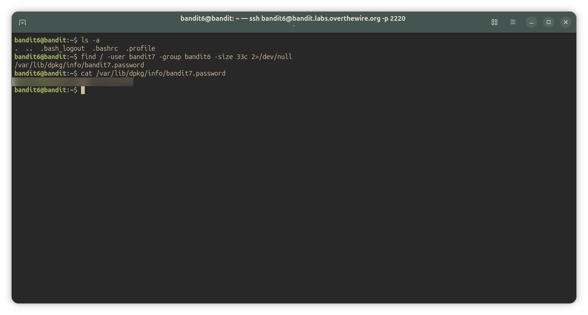

## Bandit Level 6-7
### Level Goal

The password for the next level is stored somewhere on the server and has all of the following properties:

    owned by user bandit7
    owned by group bandit6
    33 bytes in size

Commands you may need to solve this level

~~~ bash
ls , cd , cat , file , du , find , grep
~~~

#### Solution
~~~ bash
bandit6@bandit:~$ find / -type f -user bandit7 -group bandit6 -size 33c 2>/dev/null
/var/lib/dpkg/info/bandit7.password
bandit6@bandit:/$ ls -l /var/lib/dpkg/info/bandit7.password
-rw-r----- 1 bandit7 bandit6 33 Jun 24 14:59 /var/lib/dpkg/info/bandit7.password
bandit6@bandit:/$ cat /var/lib/dpkg/info/bandit7.password
<password_here>
~~~

#### Explanation
To complete the level, I had to use the command `find` this way:
~~~ bash
find / -type f -user bandit7 -group bandit6 -size 33c 2>/dev/null
~~~
I will explain each of the arguments in more depth below:
###### `/` argument
The argument `/` lets me specify from where I want to start the search. Remember that find searches recursively by default. There are other arguments for the command such as `-mindepth | -maxdepth` which limit the search range, but I didn't use them because the level goal states that **the file could be anywhere on the server**, that's why I started searching from *root (/)*.
###### `-type` argument
Specifies the type of entry I'm looking for (e.g. regular file, directory, symlink).
###### `-user` argument
The level goal asks me to find a file owned by the user `bandit7`. The argument `-user [username]` allows me to filter a search by user.
###### `-group` argument
The same purpose as `-user` argument, but filters by the file's owning group.
###### `-size` argument
Specifies the size of the file I'm looking for. Accepts different units (e.g. `c` for bytes, `k` for kilobytes, `M` for megabytes).
###### `2>/dev/null`
A 'file descriptor' is a number that identifies an open file or stream
within a process.
Every process has three standard streams (file descriptors):
-  **channel [0] Standard Input (stdin)**
    -  Where the program receives inputs, by default from the keyboard, but it can also come from a file (<) or from another command (a pipe, |)
-  **channel [1] Standard Output (stdout)**
    -  All the normal and expected output 
-  **channel [2] Standard Error (stderr)**
    -  Error and diagnostic messages the program prints when something goes wrong
      This is the `2` in `2>/dev/null`.

By default `stdout` and `stderr` are both displayed in the terminal, so they end up mixed together. If I run: 
~~~ bash
find / -type f -user bandit7 -group bandit6 -size 33c
~~~ 
the result is buried under hundreds of `Permission denied` errors, because
`find` tries to read directories I don't have access to. Adding `2>/dev/null`
redirects *stderr* to `/dev/null`, a special device that discards everything
written to it, so only the real result is shown.

#### `ls -l /var/lib/dpkg/info/bandit7.password`
After I found the file that meets all the level goal requirements, I wanted to verify that it wasn't a false positive. So I used this command `ls -l /var/lib/dpkg/info/bandit7.password`.
`ls -l` lists files with their details. It doesn't matter if it's used to list all entries inside a directory, or if it's used to get the details of a single file, it works the same way in both cases. It shows details such as:
    - permissions
    - owner
    - group
    - size
    - modification date

---
#### Screenshots/

