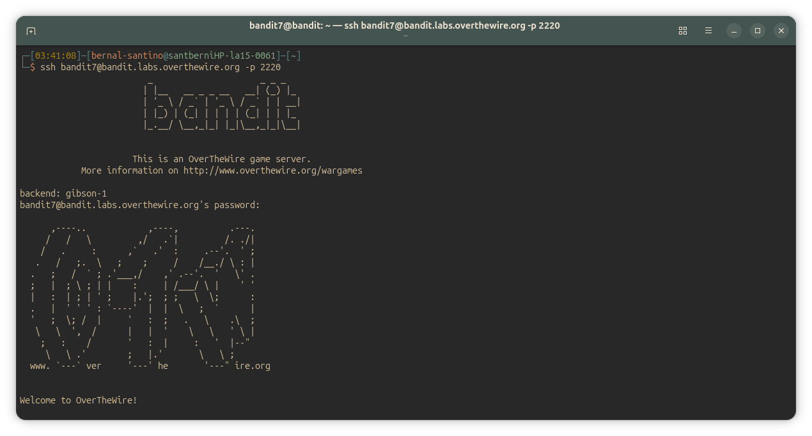
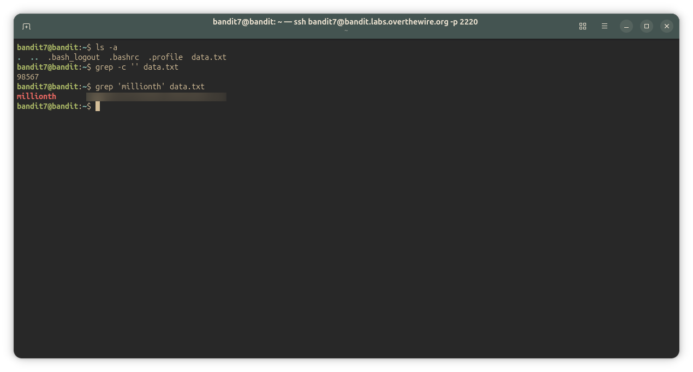

## Bandit Level 7-8
### Level Goal

The password for the next level is stored in the file data.txt next to the word millionth

Commands you may need to solve this level

~~~ bash
man, grep, sort, uniq, strings, base64, tr, tar, gzip, bzip2, xxd
~~~

#### Solution
~~~ bash
bandit7@bandit:~$ ls -a
.  ..  .bash_logout  .bashrc  .profile  data.txt
bandit7@bandit:~$ grep -c '' data.txt
98567
bandit7@bandit:~$ grep 'millionth' data.txt
millionth   <password_here>
~~~

#### Explanation
Para este nivel, como pensé que lo mejor sería utilizar un comando de filtrado, decidí probar con **`grep`**: **imprime lineas según patrones dentro de directorios o archivos que coincidan.**
`grep` se utiliza, por ejemplo, como _cuando queremos filtrar lineas en un archivo segun palabras que nos indiquen error:_
~~~ bash
journalctl -xe | grep "error:\|failed:"
~~~
(el backslash '\' es un separador que le indica al shell que '|' es un pipe y no un caracter más del string de busqueda. El 'pipe' conecta la salida de un comando con la entrada de otro)

Entonces lo utilice para imprimir la linea del archivo _data.txt_ que coincidiera con el patrón de tener la palabra _'milliont'_:
~~~bash
bandit7@bandit:~$ grep millionth data.txt
millionth	<password_here>
~~~

Previamente también utilicé `grep --count '' data.txt` para saber la cantidad de lineas que contenia el archivo antes de filtrar. Aunque segun la consigna podria haberlo salteado, lo considero como una buena practica hacer cosas como estas antes para saber con que vector de ataque estoy laburando previamente a hacer algo.
Dentro de esta linea, el parametro `--count` (o `-c`) devuelve el número de entradas (si buscamos por archivo, serian _lineas_) que coincidan con el patrón que buscamos. Como el patron es `''` (ninguno): nos imprime la cantidad de lineas _totales_ que hay en el archivo:
~~~bash
bandit7@bandit:~$ grep -c '' data.txt
98567
~~~  

---
#### Screenshots/

