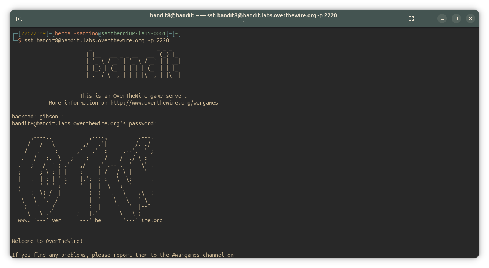
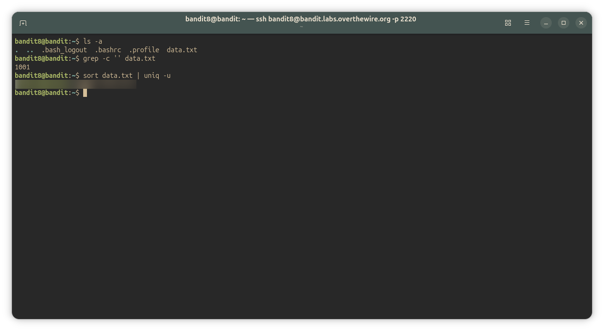

## Bandit Level 8-9

> **Level Goal:** The password for the next level is stored in the file data.txt and is the only line of text that occurs only once

Commands you may need to solve this level

~~~ bash
grep, sort, uniq, strings, base64, tr, tar, gzip, bzip2, xxd
~~~

---

## Connection Details

| Field    | Value                                                                        |
| -------- | ---------------------------------------------------------------------------- |
| Host     | `bandit.labs.overthewire.org`                                                |
| Port     | `2220`                                                                       |
| Username | `bandit8`                                                                  |
| Password | *found in [Bandit Level 7 → Level 8](../Level7/Level7.md)* |

---

## Commands Used

- `ssh` — Connects securely to the remote machine
- `ls` `ls -a` — Shows the directory content including hidden files/directories.
- `grep -c '' [FILE]` — Counts the lines of a file
- `exit` — Close the SSH session
- `sort` — Display sorted concatenation of all the file(s)
- `uniq` — Report or omit repeated lines

---

## Solution

### Step 1 — Connect to the Server

If you haven't used SSH before, see [How to connect to the server](../../sshConnection_guide) for a full explanation.

~~~ bash
ssh bandit8@bandit.labs.overthewire.org -p 2220
~~~

Use the password you found at the end of [Bandit Level 7 → Level 8](../Level7/Level7.md).

---

### Step 2 — List the Home Directory

~~~ bash
bandit8@bandit:~$ ls -a
.  ..  .bash_logout  .bashrc  .profile  data.txt
~~~

Here it is the target file `data.txt`, now we can know how many lines does it have.

~~~ bash
bandit8@bandit:~$ grep -c '' data.txt
1001
~~~

The target has 1001 lines, so we're gonna use some tools.

---

### Step 3 — Solution

~~~ bash
bandit8@bandit:~$ sort data.txt | uniq -u
<password_here>
~~~

#### Explanation
I used `sort` & `uniq --unique` because they filter the unique line(s) buried under all repeated lines in the file.
`uniq -u` filter out the repeated lines in a file to get the unique ones, but it does not detect repeated lines unless they are adjacent, if we run:
~~~ bash
bandit8@bandit:~$ uniq -u data.txt
~~~
It'll not supress any of the identical lines in the output, because in `data.txt` the lines are mixed up, the repeated ones are not already sort for `uniq` to filter them out, so we must sort the file before letting `uniq` cut them.
that's why we're using `sort data.txt | uniq -u`:

`sort data.txt` sorts the lines so the identical ones end up next to each other, and the pipe `|` passes its output as the input of `uniq -u`, returning the only line that's not repeated in all the file (the password we're looking for).

---

#### Screenshots/

---

## Key Takeaways

- **ALWAYS read the 'EXTRA' section in the man's document file** of every command I use, because then I get lost because I didn't read something as important as this: _"Note: uniq does not detect repeated lines unless they are adjacent."_
- `sort [FILE] | uniq -u` is a standard Unix pattern for finding unique lines in a file with many duplicates.
- `uniq` only detects **adjacent** duplicates, so always `sort` first when repeated lines may be mixed up. The pipe `|` is what makes this work: the output of `sort` becomes the input of `uniq`.