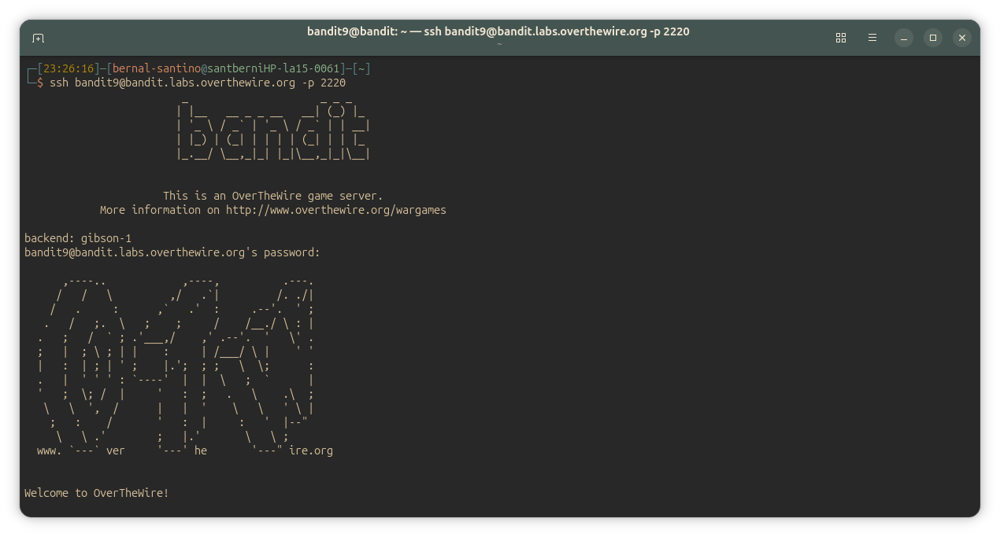
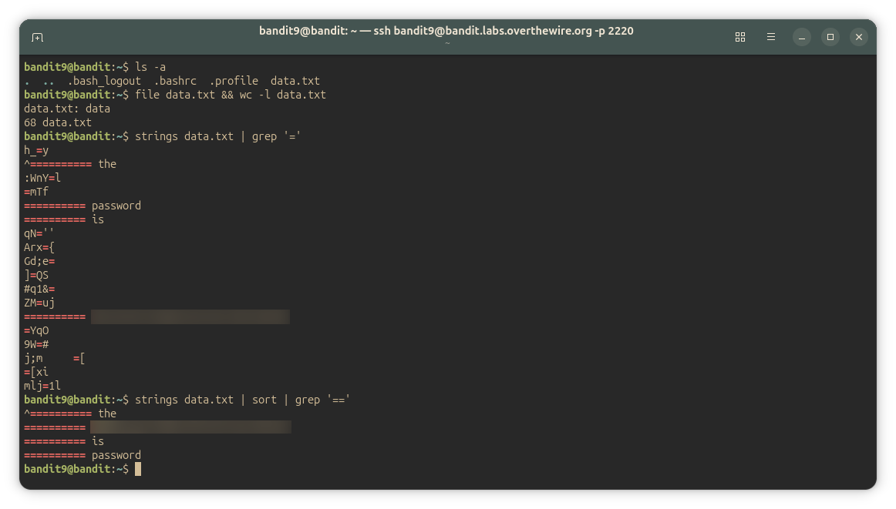

## Bandit Level 9 - 10

> **Level Goal:** The password for the next level is stored in the file data.txt in one of the few human-readable strings, preceded by several ‘=’ characters.

Commands you may need to solve this level

~~~ bash
grep, sort, uniq, strings, base64, tr, tar, gzip, bzip2, xxd
~~~

---

## Connection Details

| Field    | Value                                                                        |
| -------- | ---------------------------------------------------------------------------- |
| Host     | `bandit.labs.overthewire.org`                                                |
| Port     | `2220`                                                                       |
| Username | `bandit9`                                                                  |
| Password | *found in [Bandit Level 8 → Level 9](../Level8/Level8.md)* |

---

## Commands Used

- `ssh` — Connects securely to the remote machine
- `exit` — Close the SSH session
- `ls` `la -a` — Shows the directory content including hidden files/directories
- `file` — returns information about the type of file we're working with. ASCII text, data (binary), etc.
- `grep` — returns lines that matches a pattern in a file or in a directory

---

## Solution

### Step 1 — Connect to the Server

If you haven't used SSH before, see [How to connect to the server](../../sshConnection_guide) for a full explanation.

~~~ bash
ssh bandit9@bandit.labs.overthewire.org -p 2220
~~~

Use the password you found at the end of [Bandit Level 8 → Level 9](../Level8/Level8.md).

---

### Step 2 — Enumeration
# list the home directory
list the contents of the directory with `ls -a`, we'll find the target file (data.txt). To enumerate, we'll use `file` and `wc -l` (`-l` is the parameter to count lines) to get more information about the filetype in lines count, running `wc -l` right after `file` with '&&' pipe.

~~~ bash
bandit9@bandit:~$ ls -a
.  ..  .bash_logout  .bashrc  .profile  data.txt
bandit9@bandit:~$ file data.txt && wc -l data.txt
data.txt: data
68 data.txt
~~~

The target's data type is `data`, is a Binary, non-human readable file like ASCII text. Display it in the terminal would just show a bunch of trash, so we're gonna use some tools.
In the description of 'strings' man-file says:

> **strings** prints the printable character sequences that are at least 4 characters long ... and are followed by an unprintable character.

**strings** returns all the printable characters sequences that are followed by a non-printable character. This could be useful for printing all the string sequences in the file, and then figure out the password by suppressing the clutter that returns.
This could be done if we pipe out the result of 'strings' into 'grep', using the argument '=='.

The argument '=' is probably going to work, but the requirements talk about "preceded by several ‘=’ characters".

 So may is convenient to use '==' as parameter instaed of '=', avoiding `grep` to return lines where a single '=' matches but is unrelated to the password we're looking for. Anyway, we're using both:

 ---

## Step 3: Getting the password

~~~ bash
bandit9@bandit:~$ strings data.txt | grep '='
h_=y
^========== the
:WnY=l
=mTf
========== password
========== is
qN=''
Arx={
Gd;e=
]=QS
#q1&=
ZM=uj
========== <password_here>
=YqO
9W=#
j;m	=[
=[xi
mlj=1l
bandit9@bandit:~$ strings data.txt | sort | grep '=='
^========== the
========== <password_here>
========== is
========== password
bandit9@bandit:~$ 
~~~

> When I noticed that the password wasn't the only thing matching `=`, I used `sort` to group the related lines together. Anyway, It didn't have much effect because those four lines are the only ones that match the pattern `'=='`.

---

#### Screenshots

---

## Key Takeaways

- Always get information about the file you're working with: `file data.txt && wc -l data.txt` as enumeration instaed `cat`
- If we need to find information buried under the binary's data, you should use `string` to get all the readable characters sequences of the file you are working with. Then you can filter with `grep`