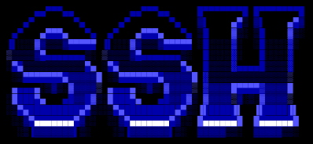

  

# How to Connect to the Server
## What is SSH?

**SSH** (Secure Shell) is a communication protocol that lets you access and control a remote computer over a network. Unlike older protocols such as Telnet or Rlogin, SSH encrypts all the traffic, so nobody can spy on your credentials or commands.

- SSH typically uses TCP port **22**.
- It's supported by all major Linux distributions, as well as macOS and Windows.

Most OverTheWire wargames are played over SSH, and this guide explains how to connect for the first time.

> **Reference:** [SSH command in Linux with examples](https://www.geeksforgeeks.org/linux-unix/ssh-command-in-linux-with-examples/) · [SSH man page](https://manpages.ubuntu.com/manpages/noble/man1/ssh.1.html)

---

## What You Need

- A terminal.
- An SSH client:
  - **Linux / macOS:** already installed. Open your terminal.
  - **Windows 10/11:** OpenSSH is included. Use PowerShell or Windows Terminal. You can also use [WSL](https://learn.microsoft.com/windows/wsl/) or [PuTTY](https://www.putty.org/).
- The **host**, **port**, **username** and **password** of the level. They're listed on each wargame's page at [overthewire.org](https://overthewire.org/wargames/).

---

## The Connection Command

~~~ bash
ssh [USERNAME]@[HOST] -p [PORT]
~~~

| Part         | Meaning                                                                                 |
| ------------ | --------------------------------------------------------------------------------------- |
| `ssh`        | The SSH client                                                                          |
| `[USERNAME]` | The user you log in as (e.g. `bandit0`)                                                 |
| `[HOST]`     | The server's domain name or IP address                                                  |
| `-p [PORT]`  | The port. SSH uses 22 by default, but OverTheWire uses a different one for each wargame |

Example (Bandit, level 0):

~~~ bash
ssh bandit0@bandit.labs.overthewire.org -p 2220
~~~

---

## First Connection

### 1. Accept the host key

The first time you connect, SSH asks you to confirm the server's identity:

~~~
The authenticity of host '[bandit.labs.overthewire.org]:2220' can't be established.
ED25519 key fingerprint is SHA256:...
Are you sure you want to continue connecting (yes/no/[fingerprint])?
~~~

Type `yes` and press Enter. SSH saves the server in `~/.ssh/known_hosts`, so it won't ask again.

### 2. Type the password

When it asks you for the password, type it and press Enter.

> **Note:** It's normal that nothing appears on the screen while you type: SSH hides the password for security. Enter it (or paste it) and press Enter.

### 3. You're in

If the password is correct, you'll see a prompt like this:

~~~ bash
bandit0@bandit:~$
~~~

From here, every command you run is executed on the remote server.

---

## Pasting and Copying in the Terminal

- **Paste:** `Ctrl + Shift + V` (Linux), `Cmd + V` (macOS), right-click or `Shift + Insert` (Windows).
- **Copy:** `Ctrl + Shift + C` (Linux), `Cmd + C` (macOS).

`Ctrl + C` on its own **doesn't copy**: it interrupts the running command.

---

## Closing the Session

~~~ bash
exit
~~~

You can also press `Ctrl + D` to end the session.

> **Warning:** OverTheWire doesn't save your progress. Keep each password in a local file that is **not** part of this repo.

---

## Useful Links

- [OverTheWire Wargames](https://overthewire.org/wargames/)
- [OverTheWire Rules](https://overthewire.org/rules/)