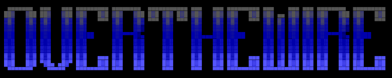

  

# What is OverTheWire?
[OverTheWire](https://overthewire.org/wargames/) is a learning platform that provides resources to learn Linux and cybersecurity concepts through **Wargames**, CTF-style challenges where the main objective is to find the password for the next level, only using the shell connected via SSH to a server provided by OverTheWire.

## Usage guide of the repo
This repo contains writeups of each level I complete, documenting my learning journey through the OverTheWire Wargames. Every top-level folder is a wargame (I'm currently working through Bandit), each wargame has its own walkthroughs of each level.
It's important for you to try yourself first before looking on a walkthrough. You start to learn when you are out of your comfort zone; try, read the manual of each command you may need to use (commands recommended by OverTheWire in every level) writing `man [COMMAND]` and `[COMMAND] --help` in the terminal.
> ***There are no passwords in this repo**, passwords and screenshots are censured according to the [OverTheWire's rules](https://overthewire.org/rules/)*

## Prerequisites

Most wargames here are played over SSH. If you've never connected to a remote server, start with [How to connect to the server](Bandit/sshConnection_guide.md).

### Folder structure
~~~
OverTheWire/
|-- README.md 
|-- Bandit/
    |-- sshConnection_guide
    |-- README.md           ← You are here
    |-- Assets/             ← Each level screenshots
    |   |-- LVL0/           
    |   |-- LVL1/
    |   |-- ...
    |-- Walkthroughs/
    |   |-- Level0/Level0.md
    |   |-- Level1/Level1.md
    |   |-- ...
~~~
